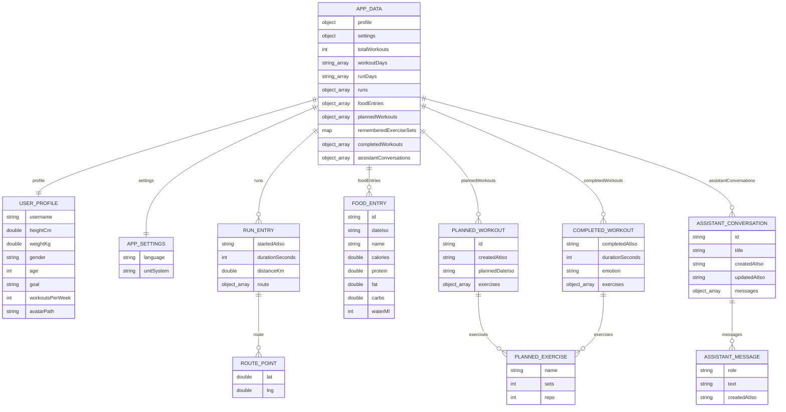
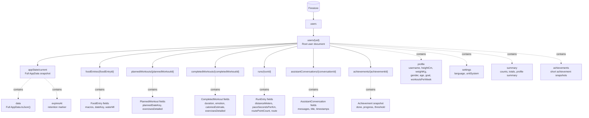
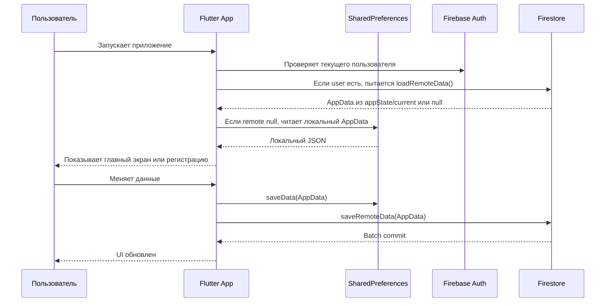

# Диаграммы Локальной БД И Firestore

В проекте Kaze Runner сейчас используются два уровня хранения данных:

- локальное хранение на устройстве через `SharedPreferences`;
- облачное хранение в Firebase Firestore.

Локальное хранение нужно для офлайн-работы и быстрого восстановления состояния приложения. Firestore нужен для сохранения аккаунта и пользовательских данных вне мобильного устройства.

## 1. Локальная БД

Важно: локальная БД здесь не является SQLite/реляционной базой. Сейчас приложение хранит один большой JSON-объект `AppData` в `SharedPreferences` под ключом:

```text
local_user_profile
```

То есть структура выглядит так:

```text
SharedPreferences
  local_user_profile: jsonEncode(AppData.toJson())
```

### Диаграмма Локальной Структуры



### Как Работает Локальное Хранение

За локальное хранение отвечает класс:

```text
LocalAppStorage
```

Основные методы:

- `loadData()` - читает строку JSON из `SharedPreferences`, декодирует ее и собирает `AppData`.
- `saveData(AppData data)` - сериализует `AppData` в JSON и сохраняет его.
- `clearData()` - удаляет локальные данные с устройства.

### Что Хранится Локально

Локально хранится почти все пользовательское состояние:

- профиль пользователя;
- язык и система единиц;
- список пробежек;
- GPS-точки маршрутов;
- записи питания;
- плановые тренировки;
- завершенные тренировки;
- упражнения, подходы и повторы;
- сохраненные значения подходов для упражнений;
- история чатов Kaze;
- дни тренировок и пробежек для календарей.

### Почему Один JSON Объект

Плюсы текущего подхода:

- просто реализовать;
- быстро загружать все состояние приложения;
- удобно синхронизировать весь `AppData` в Firestore;
- приложение легко работает офлайн.

Минусы:

- при росте данных один JSON может стать слишком большим;
- нельзя эффективно выбирать только часть данных;
- нет индексов, запросов и транзакций как в SQLite;
- сложнее делать частичные миграции.

Для текущего этапа проекта это нормальное решение. Если данных станет много, логичный следующий шаг - перейти на локальную SQLite/Drift/Isar базу.

## 2. Firestore

Firestore хранит те же данные, но в двух формах одновременно:

1. Полный снимок приложения в `users/{uid}/appState/current`.
2. Отдельные subcollections для конкретных сущностей: блюда, тренировки, пробежки, чаты, достижения.

Такой гибридный подход удобен:

- `appState/current` быстро восстанавливает все приложение целиком;
- subcollections позволяют смотреть и анализировать конкретные записи в Firebase Console;
- в будущем subcollections проще использовать для статистики, графиков, поиска, пагинации и серверной аналитики.

### Диаграмма Firestore



### Root Документ Пользователя

Путь:

```text
users/{uid}
```

Примерные поля:

```text
uid
email
displayName
providerIds
profile
settings
summary
achievements
schemaVersion
retentionDays
lastSyncedAt
lastSyncedAtIso
authCreatedAt
lastSignInAt
```

Этот документ нужен как главная карточка пользователя. Его удобно открыть в Firebase Console и сразу увидеть:

- кто пользователь;
- какая у него цель;
- сколько тренировок/пробежек/блюд;
- сколько всего километров;
- сколько достижений открыто;
- когда была последняя синхронизация.

### `appState/current`

Путь:

```text
users/{uid}/appState/current
```

Поля:

```text
ownerUid
schemaVersion
data
summary
achievements
updatedAt
updatedAtIso
expiresAt
```

`data` - это полный `AppData.toJson()`. При входе пользователя приложение может загрузить этот документ и восстановить все состояние:

- профиль;
- настройки;
- питание;
- тренировки;
- пробежки;
- чаты;
- календарные дни;
- remembered sets.

`expiresAt` выставляется примерно на 30 дней вперед. Это маркер retention-политики. Чтобы Firestore удалял документ автоматически, в Firebase Console нужно отдельно включить TTL по этому полю или сделать cleanup-логику.

## 3. Подробные Firestore Subcollections

### `foodEntries`

Путь:

```text
users/{uid}/foodEntries/{foodEntryId}
```

Документ содержит:

```text
id
dateIso
dateKey
name
calories
protein
fat
carbs
waterMl
macros
ownerUid
updatedAt
```

Зачем:

- видеть каждый прием пищи отдельно;
- строить дневную/недельную аналитику;
- фильтровать по `dateKey`;
- хранить воду вместе с приемом пищи.

### `plannedWorkouts`

Путь:

```text
users/{uid}/plannedWorkouts/{plannedWorkoutId}
```

Документ содержит:

```text
id
createdAtIso
plannedDateIso
plannedDateKey
exercises
exercisesDetailed
exerciseCount
totalSets
totalReps
ownerUid
updatedAt
```

Зачем:

- хранить конкретные плановые тренировки;
- видеть, на какую дату они назначены;
- сохранять список упражнений, подходы и повторы;
- строить календарь тренировок.

### `completedWorkouts`

Путь:

```text
users/{uid}/completedWorkouts/{completedWorkoutId}
```

Документ содержит:

```text
completedAtIso
completedDateKey
durationSeconds
durationMinutes
emotion
emotionLabelRu
emotionLabelEn
caloriesEstimate
exercises
exercisesDetailed
exerciseCount
totalSets
totalReps
ownerUid
updatedAt
```

Зачем:

- хранить не только факт тренировки, а ее подробный состав;
- считать статистику по подходам и повторам;
- считать расход калорий;
- анализировать состояние пользователя после тренировки;
- показывать историю и достижения.

### `runs`

Путь:

```text
users/{uid}/runs/{runId}
```

Документ содержит:

```text
startedAtIso
dateKey
durationSeconds
durationMinutes
distanceKm
distanceMeters
paceSecondsPerKm
route
routePointCount
ownerUid
updatedAt
```

Зачем:

- хранить каждую пробежку подробно;
- считать общий километраж;
- показывать карту маршрута;
- считать темп;
- обновлять прогресс к 42.195 км.

### `assistantConversations`

Путь:

```text
users/{uid}/assistantConversations/{conversationId}
```

Документ содержит:

```text
id
title
createdAtIso
updatedAtIso
messages
ownerUid
updatedAt
```

`messages` содержит массив сообщений:

```text
role
text
createdAtIso
```

Зачем:

- сохранять отдельные чаты Kaze;
- восстанавливать историю после входа на другом устройстве;
- позволять пользователю продолжать диалог.

### `achievements`

Путь:

```text
users/{uid}/achievements/{achievementId}
```

Документ содержит:

```text
id
group
titleRu
titleEn
descriptionRu
descriptionEn
done
progress
threshold
ownerUid
updatedAt
```

Зачем:

- видеть ачивки отдельно от полного `AppData`;
- быстро строить профиль и статистику;
- показывать прогресс по достижениям;
- в будущем отправлять уведомления при открытии достижения.

## 4. Поток Синхронизации



### Что Происходит При Сохранении

`RootPage` и `MainTabsScreen` вызывают общий callback сохранения. Дальше:

1. Формируется новый `AppData`.
2. `LocalAppStorage.saveData(data)` сохраняет JSON локально.
3. `CloudAccountService.saveRemoteData(data)` сохраняет данные в Firestore.
4. Firestore batch обновляет root document, `appState/current` и subcollections.

Если Firebase недоступен, локальное сохранение все равно работает.

## 5. Почему Данные Дублируются В Firestore

На первый взгляд `appState/current` и subcollections дублируют данные. Это сделано осознанно.

### `appState/current`

Плюсы:

- быстро загрузить все приложение одним документом;
- проще восстановить состояние после входа;
- проще сохранить backward compatibility;
- удобно для офлайн-first логики.

Минусы:

- документ может расти;
- нельзя удобно делать запросы по отдельным блюдам/пробежкам;
- ограничение Firestore на размер документа может стать проблемой при большом объеме истории.

### Subcollections

Плюсы:

- каждая запись отдельным документом;
- можно фильтровать по датам;
- можно строить аналитику;
- легче добавлять пагинацию;
- удобно смотреть данные в Firebase Console.

Минусы:

- больше write operations;
- нужно следить за консистентностью;
- при удалении аккаунта нужно чистить subcollections.

Текущая схема сочетает удобную загрузку всего состояния и возможность подробного облачного хранения.

## 6. Правила Доступа Firestore

Текущие правила:

```text
match /users/{userId} {
  allow read, create, update, delete: if request.auth.uid == userId;

  match /{document=**} {
    allow read, create, update, delete: if request.auth.uid == userId;
  }
}
```

Смысл:

- пользователь может читать только свой `users/{uid}`;
- пользователь может изменять только свои subcollections;
- чужие данные недоступны.

## 7. Что Можно Улучшить Дальше

### Локально

Если история станет большой, стоит перейти с `SharedPreferences` на:

- SQLite;
- Drift;
- Isar;
- Hive.

Тогда можно будет хранить блюда, тренировки и пробежки отдельными локальными таблицами/коллекциями.

### В Firestore

Полезные будущие улучшения:

- включить TTL по `expiresAt`;
- добавить `createdAt` в каждый subcollection document;
- хранить `deletedAt` для мягкого удаления;
- добавить версионирование схемы на уровне каждой коллекции;
- добавить server-side cleanup;
- добавить Cloud Function/Worker для агрегаций;
- ограничить размер `appState/current`, если история станет большой.

### Для Аналитики

Можно добавить отдельные агрегаты:

```text
users/{uid}/dailyStats/{yyyy-mm-dd}
users/{uid}/weeklyStats/{yyyy-ww}
users/{uid}/monthlyStats/{yyyy-mm}
```

Туда можно складывать:

- калории за день;
- БЖУ за день;
- воду;
- минуты тренировок;
- сожженные калории;
- километры бега;
- количество приемов пищи;
- completed/planned workout counters.

Это ускорит графики и снизит необходимость каждый раз пересчитывать всю историю на клиенте.
