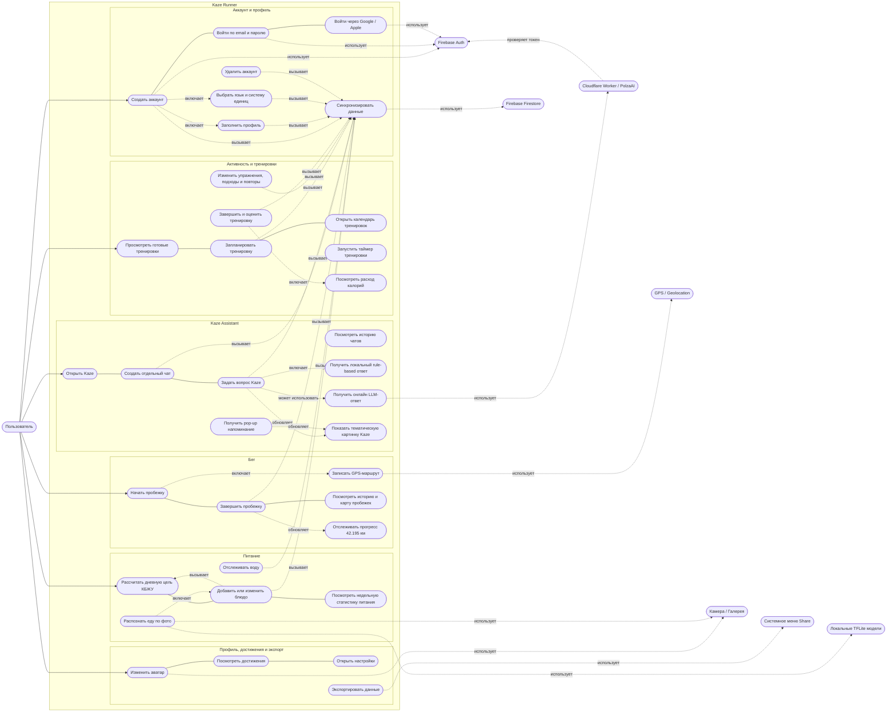

# Диаграмма Прецедентов Kaze Runner

Ниже приведена диаграмма прецедентов приложения Kaze Runner в формате Mermaid. Ее можно открыть в Markdown-просмотрщике с поддержкой Mermaid, например в GitHub, некоторых IDE-плагинах или Mermaid Live Editor.

## Актеры

- `Пользователь` - основной актер приложения. Создает аккаунт, ведет тренировки, питание, пробежки, профиль и общается с Kaze.
- `Firebase Auth` - внешний сервис авторизации. Используется для email/password, Google и Apple входа.
- `Firebase Firestore` - внешнее облачное хранилище пользовательских данных.
- `Cloudflare Worker / PolzaAI` - внешний AI-бэкенд для онлайн-ответов Kaze.
- `GPS / Geolocation` - системный сервис устройства для записи маршрута пробежки.
- `Камера / Галерея` - системные источники изображений для аватара и распознавания еды.
- `Системное меню Share` - системный механизм сохранения/отправки экспортированных файлов.
- `Локальные TFLite модели` - локальные ML-модели для распознавания еды и оценки КБЖУ.

## Основные Группы Прецедентов

### Аккаунт и профиль

Пользователь может создать аккаунт, войти по email/password, Google или Apple, заполнить профиль, выбрать язык и систему единиц. После изменений приложение сохраняет данные локально и синхронизирует их с Firestore.

### Активность и тренировки

Пользователь выбирает готовую тренировку, планирует ее на дату, открывает календарь, запускает таймер, редактирует упражнения, завершает тренировку и оценивает состояние. Завершенная тренировка сохраняется подробно: упражнения, подходы, повторы, длительность и эмоция.

### Питание

Пользователь видит индивидуальную дневную цель КБЖУ, добавляет блюда, редактирует их, отслеживает воду и недельную статистику. Дополнительно можно распознать еду по фото через локальные TFLite-модели, а затем вручную поправить результат.

### Бег

Пользователь запускает пробежку, приложение записывает GPS-маршрут и считает дистанцию. После завершения пробежка сохраняется, появляется в истории, отображается на карте и обновляет прогресс к марафонской дистанции 42.195 км.

### Профиль, достижения и экспорт

Пользователь меняет аватар, смотрит достижения, открывает настройки и экспортирует данные. Экспорт формирует три JSON-файла: тренировки, пробежки и питание, после чего открывает системное меню Share.

### Kaze Assistant

Пользователь открывает Kaze, создает отдельный чат, смотрит историю и задает вопросы. Kaze всегда может ответить локально через rule-based модель. Если задан `KAZE_ASSISTANT_URL`, приложение пробует получить онлайн-ответ через Cloudflare Worker / PolzaAI. Тематическая картинка Kaze меняется в зависимости от контекста: размышление, питание, тренировка, бег, сон или напоминание.
